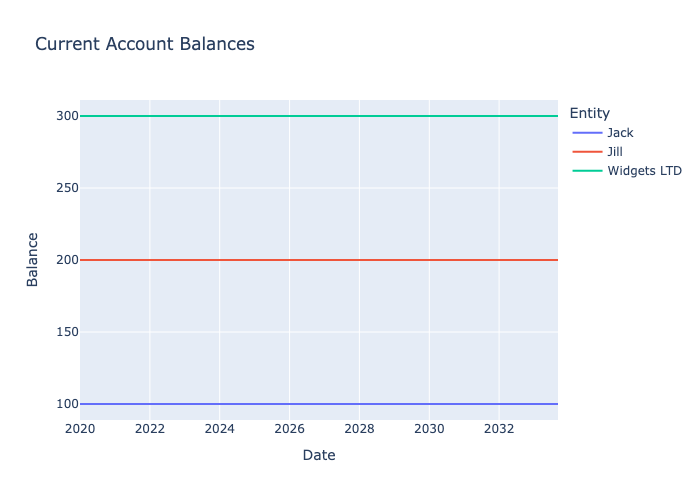
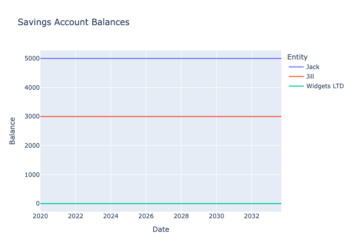

```python
from datetime import date
from decimal import Decimal
from itertools import islice

from financial_simulator import FinancialSimulator
from financial_simulator.lib.accounting import Books, Transaction, Change
from financial_simulator.lib.entities import Individual, Corporation
from financial_simulator.lib.factories.bank_accounts import \
    create_abn_amro_personal_current, \
    create_abn_amro_personal_savings, \
    create_ing_business_current
from financial_simulator.lib.providers import NeverProvider
from financial_simulator.lib.util.data import plot_account_balances
```

# Simulation


```python
initial_date = date(2019, 12, 31)

jack = Individual(name='jack',
                  books=Books.create(Transaction(transaction_date=initial_date,
                                                 description='Initial transaction',
                                                 changes=(Change(amount=Decimal('-100.0'),
                                                                 account_path=('assets', 'bank_accounts', 'current')),
                                                          Change(amount=Decimal('-5000.0'),
                                                                 account_path=('assets', 'bank_accounts', 'savings')),
                                                          Change(amount=Decimal('5100.0'),
                                                                 account_path=('liabilities', 'equity'))))),
                  expenses=NeverProvider(),
                  bank_accounts=(create_abn_amro_personal_current('current'),
                                 create_abn_amro_personal_savings('savings')),
                  investments=(),
                  properties=(),
                  loans=())

jill = Individual(name='jill',
                  books=Books.create(Transaction(transaction_date=initial_date,
                                                 description='Initial transaction',
                                                 changes=(Change(amount=Decimal('-200.0'),
                                                                 account_path=('assets', 'bank_accounts', 'current')),
                                                          Change(amount=Decimal('-3000.0'),
                                                                 account_path=('assets', 'bank_accounts', 'savings')),
                                                          Change(amount=Decimal('3200.0'),
                                                                 account_path=('liabilities', 'equity'))))),
                  expenses=NeverProvider(),
                  bank_accounts=(create_abn_amro_personal_current('current'),
                                 create_abn_amro_personal_savings('savings')),
                  investments=(),
                  properties=(),
                  loans=())

widgets_ltd = Corporation(name='widgets_ltd',
                          books=Books.create(Transaction(transaction_date=initial_date,
                                                         description='Initial transaction',
                                                         changes=(Change(amount=Decimal('-300.0'),
                                                                         account_path=('assets', 'bank_accounts',
                                                                                       'current')),
                                                                  Change(amount=Decimal('300.0'),
                                                                         account_path=('liabilities', 'equity'))))),
                          operating_expenses=NeverProvider(),
                          capital_expenses=NeverProvider(),
                          depreciation=NeverProvider(),
                          income=NeverProvider(),
                          bank_accounts=(create_ing_business_current('current'),),
                          investments=(),
                          properties=(),
                          loans=(),
                          salaries=())

engine = FinancialSimulator(current_date=initial_date,
                            current_entities=(jack, jill, widgets_ltd))

days = list(islice(engine, 5000))
```

## Current account balances


```python
fig = plot_account_balances(days=days,
                            account_path=('assets', 'bank_accounts', 'current'),
                            columns=('Jack', 'Jill', 'Widgets LTD'),
                            title='Current Account Balances',
                            is_debit_account=True)
fig.write_image('simulation.assets/current_account_balances.png')
fig.show()
```




# Savings account balances


```python
fig = plot_account_balances(days=days,
                            account_path=('assets', 'bank_accounts', 'savings'),
                            columns=('Jack', 'Jill', 'Widgets LTD'),
                            title='Savings Account Balances',
                            is_debit_account=True)
fig.write_image('simulation.assets/savings_account_balances.png')
fig.show()
```



